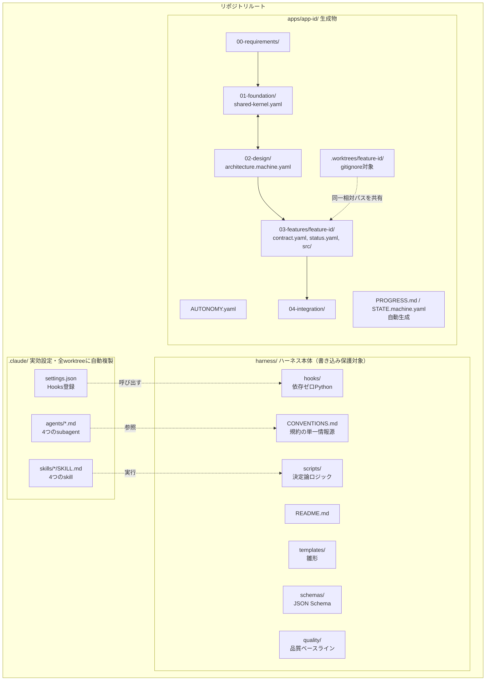
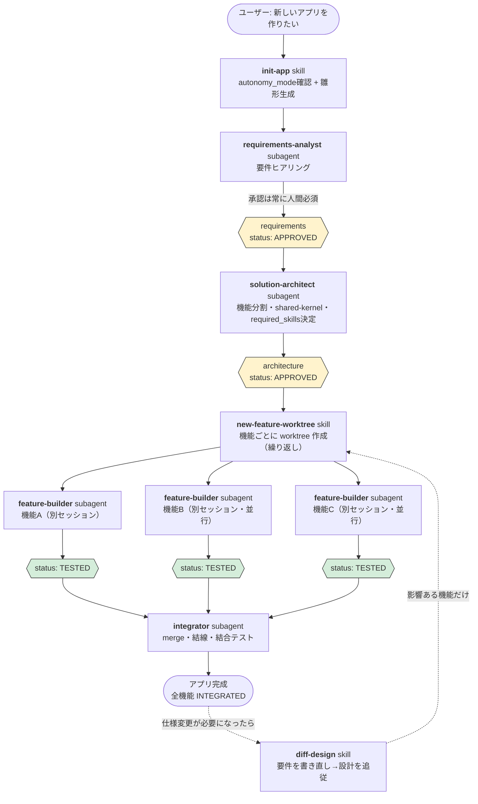
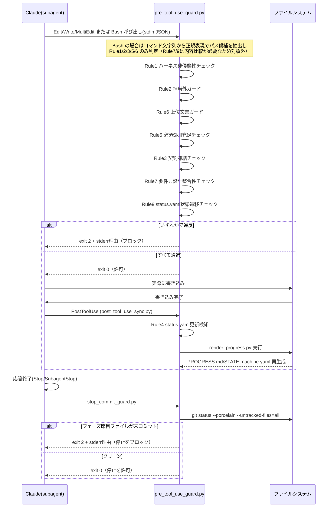
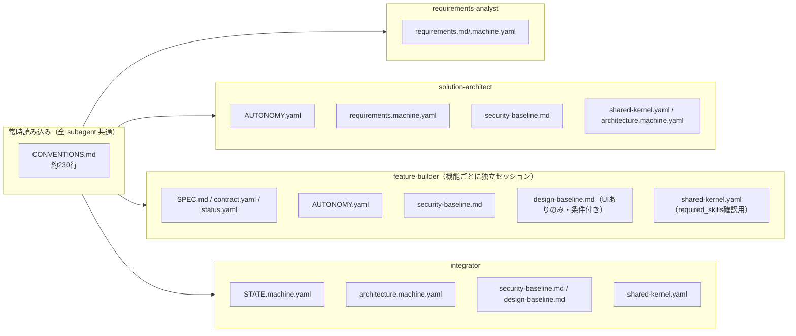
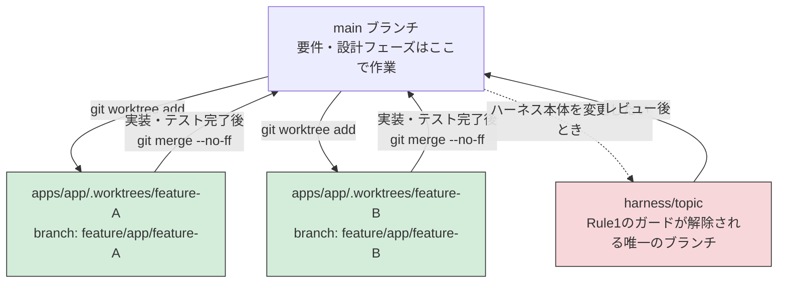
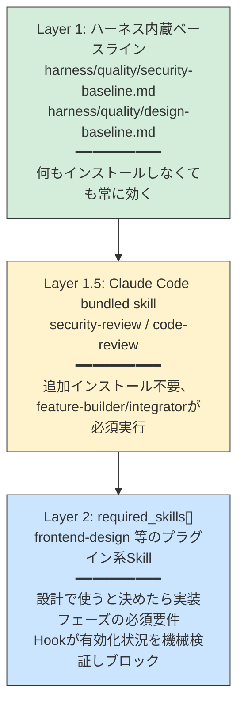

# apparness ハーネス 完全ガイド

このリポジトリ（`apparness`）に構築した「どんなアプリでも Claude Code 駆動で自動生成できるハーネス」の説明書です。思想、使い方、フェーズごとにどのエージェント・スキル・フックが動くか、それぞれが何を読み込むか、決定論的に強制される部分とAIの判断に委ねられる部分の境界、ブランチ運用とその制限をまとめています。

作成日: 2026-08-20 / 対象バージョン: v0（`harness/quality-baseline` ブランチ時点）

---

## 目次

1. [思想](#1-思想)
2. [全体像（ディレクトリマップ）](#2-全体像ディレクトリマップ)
3. [ワークフロー全体図](#3-ワークフロー全体図)
4. [フェーズ詳細](#4-フェーズ詳細)
5. [Hooks が強制する9つのルール（決定論レイヤー）](#5-hooks-が強制する9つのルール決定論レイヤー)
6. [コンテキスト消費マップ](#6-コンテキスト消費マップ)
7. [決定論 vs AI判断 対照表](#7-決定論-vs-ai判断-対照表)
8. [ブランチ・worktree 運用とその制限](#8-ブランチworktree-運用とその制限)
9. [品質保証の二層構造](#9-品質保証の二層構造)
10. [自動化モード（AUTONOMY.yaml）](#10-自動化モードautonomyyaml)
11. [既知の制約・v1以降の拡張候補](#11-既知の制約v1以降の拡張候補)

---

## 1. 思想

アプリ作成を AI エージェントに任せると、コンテキストが肥大化するほど精度が落ち、また「約束事項」がAIの自己申告だけに頼ると守られたり守られなかったりが安定しない、という2つの問題が起きます。このハーネスは次の原則でこれに対応します。

| 原則 | 内容 |
|---|---|
| **最小機能単位への分割** | アプリを「入出力さえわかれば内部を知らなくてよい」独立機能に分割し、機能ごとにコンテキストをクリアして作業する |
| **契約ファースト** | 各機能の入出力は `contract.yaml` として先に確定・凍結し、実装はそれだけを見て進められるようにする |
| **並行作業前提** | 機能ごとに `git worktree` を切り、複数人（または複数セッション）が同時に別機能へ取り組める |
| **中断・再開性** | いつ止めても `STATE.machine.yaml`（機械向け）と `PROGRESS.md`（人間向け、自動生成）を見れば続きから再開できる |
| **上位文書優先** | 要件定義 > 設計 > 機能契約の順で重要度が高く、下位だけを直して上位を放置することを許さない |
| **決定論的な強制** | 「守ってほしいこと」は可能な限り Hooks（Pythonスクリプト）で機械的に強制し、AIの遵守任せにしない |
| **ハーネスと生成物の分離** | `harness/`・`.claude/` はテンプレート本体で書き込み保護の対象。生成物は `apps/<app-id>/` に閉じる |

---

## 2. 全体像（ディレクトリマップ）



- `.claude/` と `harness/` を合わせて「ハーネス本体」と呼びます。テンプレートとして繰り返し使い回すことを想定しており、アプリ作成中は原則書き込み禁止です（[8節](#8-ブランチworktree-運用とその制限)）。
- `apps/<app-id>/` はアプリ作成のたびに `init-app` skill が生成する成果物です。

---

## 3. ワークフロー全体図



いつ中断しても、`apps/<app-id>/STATE.machine.yaml`（機械向け）と `PROGRESS.md`（人間向け）を見ればどこで止まっているか・次に何をすべきかが分かります。この2ファイルは `render_progress.py` による自動生成で、手書きはしません。

---

## 4. フェーズ詳細

各フェーズについて、①いつ使われるか ②読み込む/参照するファイル（コンテキスト消費の源） ③決定論的に実行される部分とAIが判断する部分、を整理します。

### 4.1 `init-app` skill

| 項目 | 内容 |
|---|---|
| 使われるタイミング | 新規アプリ作成の開始時。ユーザーが「新しいアプリを作りたい」と言ったとき |
| 読み込むファイル | `harness/CONVENTIONS.md` 9節（自動化モードの説明） |
| 実行するスクリプト | `harness/scripts/new_app_scaffold.py`（**決定論**：雛形一式の生成、`AUTONOMY.yaml`・`00-requirements/`・`01-foundation/`・`02-design/`・`04-integration/` を作成し `render_progress.py` を呼ぶ） |
| AIが判断する部分 | `app_id`/`app_name` の確認、`AskUserQuestion` での `autonomy_mode` 確認（未回答なら `SUPERVISED` を既定にしてよい） |
| 決定論的な部分 | 雛形ファイルの内容そのもの（テンプレートから生成、AIは中身を作文しない） |
| 完了後のコミット | `git add -A && git commit`（AIが実行するが、内容は雛形そのものなので実質固定的） |

### 4.2 `requirements-analyst` subagent

| 項目 | 内容 |
|---|---|
| 使われるタイミング | `init-app` の直後。要件定義フェーズ |
| tools | Read, Write, Edit, Glob, Grep, AskUserQuestion, Bash |
| 読み込むファイル | `harness/CONVENTIONS.md`（全文）、`apps/<app-id>/00-requirements/requirements.md`・`requirements.machine.yaml` |
| 触ってよい範囲 | `apps/<app-id>/00-requirements/` 配下のみ |
| 実行するスクリプト | `harness/scripts/validate_yaml.py`（**決定論**：`requirements.schema.json` に対する検証。更新のたびに実行） |
| AIが判断する部分 | ユーザーとの対話内容（目的・ゴール・機能要件など）、`open_questions` が解消されたかの判断 |
| **決定論で強制される部分** | ①`status: APPROVED` にする際、`approved_by`/`approved_at` が空だと **JSON Schema の `if/then` 制約で弾かれる**。②**要件定義の承認だけは `AUTONOMY.yaml` のモードに関わらず常に人間の明示的な返答が必須**（ただしこれ自体はプロンプト上の指示であり、Hookによる強制ではない＝AIの遵守に依存する） |

### 4.3 `solution-architect` subagent

| 項目 | 内容 |
|---|---|
| 使われるタイミング | 要件承認後。設計フェーズ |
| tools | Read, Write, Edit, Glob, Grep, Bash, WebSearch, WebFetch, AskUserQuestion |
| 読み込むファイル | `harness/CONVENTIONS.md`（6, 9, 10, 11節）、`apps/<app-id>/AUTONOMY.yaml`、`00-requirements/requirements.machine.yaml`、`harness/quality/security-baseline.md` |
| 触ってよい範囲 | `apps/<app-id>/01-foundation/` と `02-design/` のみ |
| 進め方の特徴 | `shared-kernel.yaml`（共通部分）と `architecture.machine.yaml`（機能分割）を**逐次ではなく反復**して収束させる（[CONVENTIONS.md 11節](harness/CONVENTIONS.md)） |
| AIが判断する部分 | 機能分割案、技術スタック選定（ライセンス・脆弱性をWebSearchで調査）、`required_skills[]` に追加するかどうかの判断 |
| **決定論で強制される部分** | ①`status: APPROVED` 時の `approved_by`/`approved_at` 必須（スキーマ）。②**`based_on_requirements_version` が要件の現在の `version` と一致しないと Hook が APPROVED への変更自体を拒否**（Rule 7、正真正銘のブロック）。③APPROVED後は `contract.yaml`（設計時ドラフト）が凍結され Hook が書き込みを拒否（Rule 3） |
| 実行するスクリプト | `harness/scripts/validate_yaml.py` |

### 4.4 `new-feature-worktree` skill

| 項目 | 内容 |
|---|---|
| 使われるタイミング | 設計承認後、機能ごとに実装へ着手するとき（繰り返し実行） |
| 実行するスクリプト | `harness/scripts/new_feature_scaffold.py`（**決定論**：`architecture.machine.yaml` が APPROVED か検証 → `git worktree add` → `SPEC.md`/`contract.yaml`/`status.yaml`/`src/`/`tests/`/`.claude/` を生成 → 初期コミット） |
| AIが判断する部分 | `app_id`/`feature_id` の確認のみ。生成内容自体はテンプレート駆動 |
| 決定論的な部分 | worktree のパス・ブランチ名は固定規則（[8節](#8-ブランチworktree-運用とその制限)）。冪等（既存なら再利用） |

### 4.5 `feature-builder` subagent

| 項目 | 内容 |
|---|---|
| 使われるタイミング | 機能ごとの worktree 内で、担当者が新規セッションを開始したとき |
| tools / skills | Read, Write, Edit, MultiEdit, Bash, Glob, Grep, Skill／`skills: code-review`（frontmatterでプリロード） |
| 読み込むファイル | `SPEC.md`、`contract.yaml`、`status.yaml`、`apps/<app-id>/AUTONOMY.yaml`、`harness/quality/security-baseline.md`、（UIありなら）`harness/quality/design-baseline.md`、`../../01-foundation/shared-kernel.yaml`（`required_skills[]` 確認用） |
| 触ってよい範囲 | 自分の `03-features/<feature-id>/` 配下のみ |
| AIが判断する部分 | 実装そのもの、テスト内容、`code-review` の指摘への対応 |
| **決定論で強制される部分** | ①他機能・要件・共有基盤・設計・ハーネス本体への書き込みは **すべて Hook が拒否**（Rule 1, 2, 6）。②**`src/**` への最初の書き込み時、`required_skills[]` の各Skillが有効化されていなければ実装そのものをブロック**（Rule 5）。③承認済み `contract.yaml` は凍結され書き込み拒否（Rule 3） |
| 実行するSkill | `code-review`（bundled、`TESTED` にする前に必須実行。見つからなければ報告して続行） |

### 4.6 `integrator` subagent

| 項目 | 内容 |
|---|---|
| 使われるタイミング | 全機能が `TESTED` 以上になった後。メインの worktree（リポジトリ本体）で実行 |
| tools / skills | Read, Write, Edit, Bash, Glob, Grep, Skill／`skills: security-review, code-review` |
| 読み込むファイル | `STATE.machine.yaml`、`architecture.machine.yaml`（`interfaces[]`）、`harness/quality/security-baseline.md`・`design-baseline.md`、`shared-kernel.yaml`（`required_skills[]`） |
| 触ってよい範囲 | 各 feature ブランチの merge、`04-integration/` 配下の結線・テストコード作成 |
| AIが判断する部分 | 結線コードの書き方、結合テストのシナリオ設計 |
| **決定論で強制される部分** | 統合完了直前に `security-review`・`code-review` の実行が手順として必須（プロンプト指示。見つからなければ報告のみで先に進める＝Hookではなく運用ルール） |
| 完了条件 | 結合テストコードを `04-integration/` に資産として残すこと。`integration.md` に手順・結線箇所・テスト結果を記録 |

### 4.7 `diff-design` skill

| 項目 | 内容 |
|---|---|
| 使われるタイミング | 仕様変更・要件追加が必要になったとき |
| 手順 | ①`requirements-analyst` で変更ヒアリング → 旧要件を `00-requirements/history/` に退避 → `version` インクリメント → 承認。②`solution-architect` で新設計（`based_on_requirements_version` 更新）→ 旧設計を `02-design/history/` に退避。③`diff_architecture.py` で機能差分算出（**決定論**）。④変更機能のみ新規 `feature-id` で `new-feature-worktree`、変更なしは再利用 |
| **決定論で強制される部分** | 新しい `architecture.machine.yaml` を APPROVED にする際、Rule 7 が要件versionとの整合性を検証 |

### 4.8 `sync-progress` skill

| 項目 | 内容 |
|---|---|
| 使われるタイミング | 進捗を手動で強制リフレッシュしたいとき（通常は Rule 4 が自動実行するため不要） |
| 実行するスクリプト | `harness/scripts/render_progress.py --app <id>` または `--all`（完全決定論） |

---

## 5. Hooks が強制する9つのルール（決定論レイヤー）

`harness/hooks/pre_tool_use_guard.py`（PreToolUse）・`post_tool_use_sync.py`（PostToolUse）・`stop_commit_guard.py`（Stop/SubagentStop）で実装。**依存ゼロの標準ライブラリのみ**で動作し、ツール呼び出し・応答終了のたびに毎回起動されます。



| # | ルール名 | 何を見るか | ブロック条件 |
|---|---|---|---|
| 1 | ハーネス非侵襲性 | `harness/**`, `.claude/**` への書き込み | 現在のブランチが `harness/` プレフィックスでない（`.claude/settings.local.json` は例外） |
| 2 | 担当外ガード | `03-features/<id>/**`（`status.yaml`除く） | 現在の worktree のルート basename が `<id>` と不一致 |
| 3 | 契約凍結 | `contract.yaml` | 対応する `status.yaml` の `state` が `CONTRACT_DRAFTED` を超えている |
| 4 | 進捗自動再生成 | `status.yaml` の更新（PostToolUse） | 常に非ブロッキングで `render_progress.py` を実行 |
| 5 | 必須Skill充足ゲート | `03-features/<id>/src/**` | `shared-kernel.yaml` の `required_skills[]` の `plugin_ref` が `enabledPlugins` に無い |
| 6 | 上位文書ガード | feature用worktreeからの `00-requirements/`・`01-foundation/`・`02-design/` | 常にブロック（メインworktreeからは対象外） |
| 7 | 要件↔設計整合性 | `architecture.machine.yaml` を `APPROVED` にする書き込み | `based_on_requirements_version` ≠ `requirements.machine.yaml` の現在の `version` |
| 8 | フェーズ節目のコミット強制 | `status.yaml`/`requirements.machine.yaml`/`architecture.machine.yaml`（Stop/SubagentStop） | いずれかが `git status --porcelain --untracked-files=all` で未コミット |
| 9 | 状態遷移の妥当性チェック | `status.yaml` の `state` 書き換え | 書き込み前後の `state` が妥当な遷移でない（直線状態の後退・複数段階の飛び越し、終端状態からの変更） |

**Edit/Write/MultiEdit/NotebookEdit** に加え、**Rule 1・2・3・5・6 は `Bash` 経由の間接書き込み**（`sed -i` / `cp` / `mv` / `tee` / リダイレクト等）**もブロック**します（v1。`shlex` によるクォート考慮トークン化で判定するため、クォート内の文字列（`echo "a >> b"` の `>>` 等）を演算子と誤認識しない。変数展開されたパス等の検知漏れは残るが許容する。**バイパス用の環境変数は意図的に用意しない**——AIがブロックされた際に自ら解除できてしまうと決定論的強制が崩れるため。Rule 7・9 は書き込み前後の内容比較が必要なため Bash 経由では判定対象外）。Rule 8 は例外的に `Stop`/`SubagentStop` イベントで動作し、ツール呼び出しではなく応答終了そのものをブロックします。Rule 9 は `BLOCKED` を経由した遷移は検証せず自由に通す既知の簡略化があります（11節）。

---

## 6. コンテキスト消費マップ

各エージェント・スキルが「常時（起動時に必ず）」読むファイルと「条件付き」で読むファイルを分けています。`harness/CONVENTIONS.md` は全 subagent が起動時に読むため、これが実質的な「共通の最低コンテキストコスト」になります（2026-08-20時点で約230行）。



| Subagent / Skill | 常時読むファイル | 条件付きで読むファイル |
|---|---|---|
| `requirements-analyst` | `CONVENTIONS.md`, `requirements.md`, `requirements.machine.yaml` | なし |
| `solution-architect` | `CONVENTIONS.md`, `AUTONOMY.yaml`, `requirements.machine.yaml`, `security-baseline.md` | WebSearch結果（ライブラリ調査時） |
| `feature-builder` | `CONVENTIONS.md`, `SPEC.md`, `contract.yaml`, `status.yaml`, `AUTONOMY.yaml`, `security-baseline.md`, `shared-kernel.yaml` | `design-baseline.md`（UIを持つ機能のみ） |
| `integrator` | `CONVENTIONS.md`, `STATE.machine.yaml`, `architecture.machine.yaml`, `security-baseline.md`, `shared-kernel.yaml` | `design-baseline.md`（UIありのみ） |
| `init-app` skill | `CONVENTIONS.md` 9節相当 | なし |
| `new-feature-worktree` skill | `architecture.machine.yaml`（features[]確認のみ） | なし |
| `diff-design` skill | `CONVENTIONS.md` 11節相当 | 旧バージョンのrequirements/architecture（history/） |

**設計上の意図**: `harness/quality/*.md`（品質ベースライン）は `CONVENTIONS.md` に内容を埋め込まず、該当フェーズでのみ `Read` される別ファイルにしています。これにより、品質基準を使わないフェーズ（例: `requirements-analyst`）では一切コンテキストを消費しません。

---

## 7. 決定論 vs AI判断 対照表

「確実に実行される（Hookやスクリプトが機械的に強制する）」ものと「AIが妥当と判断して実行する（プロンプト上の指示に依存する）」ものを区別します。後者は AutonomyMode や状況次第で省略・誤判断されうる点に注意してください。

| 動作 | 決定論（Hook/スクリプトで強制） | AI判断（プロンプト依存） |
|---|---|---|
| ハーネス本体への書き込み拒否 | ✅ Rule 1（PreToolUse） | — |
| 担当外機能ディレクトリへの書き込み拒否 | ✅ Rule 2 | — |
| 契約の凍結 | ✅ Rule 3 | — |
| PROGRESS.md/STATE.machine.yaml の再生成 | ✅ Rule 4（PostToolUse） | — |
| 必須Skillが無い実装のブロック | ✅ Rule 5 | — |
| feature-builderの要件/設計への書き込み拒否 | ✅ Rule 6 | — |
| 要件と設計のバージョン不整合を APPROVED にさせない | ✅ Rule 7 | — |
| status.yaml の state 遷移の妥当性（飛び越し・後退・終端状態からの変更） | ✅ Rule 9（`BLOCKED` 経由は除く） | ⚠️ `BLOCKED` を経由した場合のみ実質的なレベル妥当性はAI判断依存 |
| `approved_by`/`approved_at` の未入力での承認防止 | ✅ JSON Schema `if/then` | — |
| YAML/JSON構文・スキーマ適合の検証 | ✅ `validate_yaml.py` | — |
| worktree・雛形ファイルの生成 | ✅ `new_app_scaffold.py`/`new_feature_scaffold.py` | — |
| 機能差分の算出 | ✅ `diff_architecture.py` | — |
| **要件定義の最終承認を人間が明示的に行ったか** | ❌ | ⚠️ プロンプトの指示のみ（Hookは対話の意味を判定できない） |
| 自動化モード（MANUAL/SUPERVISED/AUTONOMOUS）に応じた確認頻度 | ❌ | ⚠️ subagentが `AUTONOMY.yaml` を読んで自己判断 |
| 機能分割の粒度・独立性の妥当性 | ❌ | ⚠️ `solution-architect` の設計判断 |
| 技術スタックの安全性（脆弱性・保守状況）評価 | ❌ | ⚠️ WebSearchに基づくAI判断 |
| `security-review`/`code-review` の実行そのもの | ❌ | ⚠️ プロンプト上の必須手順（実行を忘れる/スキップする余地は理論上ある） |
| 実装の正しさ・テストの十分性 | ❌ | ⚠️ feature-builderの判断 |
| 結合テストのシナリオ網羅性 | ❌ | ⚠️ integratorの判断 |
| フェーズ節目（status.yaml等）のコミット実行 | ✅ Rule 8（Stop/SubagentStop） | — |
| コミット内容の妥当性（メッセージ・粒度） | ❌ | ⚠️ プロンプトの指示に依存（コミットが行われること自体はRule 8が強制） |
| Bash経由の間接的な書き込み（Rule1/2/3/5/6相当） | ✅ `shlex`トークン化で検知しブロック（バイパス用環境変数なし） | — |

**読み方**: ✅ は「Claudeが指示に従わなくても、システムが機械的に阻止/実行する」層。⚠️ は「プロンプトに明記されているが、最終的にはAIの遵守に依存する」層です。⚠️ の項目は `PROGRESS.md` の `autonomy_mode` 表示や、人間によるレビューで補完することを前提としています。

---

## 8. ブランチ・worktree 運用とその制限



### ブランチ命名規則

| 用途 | 形式 | 例 |
|---|---|---|
| アプリ雛形作成 | `app/<app-id>/bootstrap` | `app/hello-world-todo/bootstrap` |
| 機能実装 | `feature/<app-id>/<feature-id>` | `feature/hello-world-todo/todo-list-api` |
| ハーネス保守 | `harness/<topic>` | `harness/fix-progress-renderer` |
| 統合作業（任意） | `integration/<app-id>` | `integration/hello-world-todo` |

### worktree パス規則

```
apps/<app-id>/.worktrees/<feature-id>/apps/<app-id>/03-features/<feature-id>/   ← 担当者はここをcwdにする
```
git worktree は同一リポジトリの追跡ファイルをそのままチェックアウトするため、worktree内にも `apps/<app-id>/03-features/<feature-id>/` という同一の相対パスが現れます。ルート直下の `.claude/`（hooks/agents/skills）もこの複製に含まれるため、**追加設定なしに全worktreeで同じHooksが有効**になります。

### ブランチによる制限（Rule 1 との関係）

| 現在のブランチ | `harness/**`・`.claude/**` への書き込み |
|---|---|
| `main` またはその他 | ❌ 拒否（`HARNESS_UNLOCK=1` で一時解除可能） |
| `harness/<topic>` | ✅ 許可 |
| feature用worktree（`feature/...`） | ❌ 拒否。かつ Rule 6 により要件・共有基盤・設計文書も拒否 |

つまり、**ハーネス本体を変更してよいのは `harness/<topic>` ブランチだけ**であり、これはこのガイド自体を作成した今回の作業でも実際に踏んだ制約です（`main` ブランチで `harness/quality/*.md` を書こうとして Hook に拒否され、`harness/quality-baseline` ブランチへ切り替えました）。

---

## 9. 品質保証の二層構造

「専門的な外部Skillが入っていない環境では品質が保証されない」状態を避けるための構造です。



- **Layer 1**は依存ゼロで常に効く最低ライン。`CONVENTIONS.md` には内容を埋め込まず、該当フェーズで初めて `Read` される（コンテキストは必要なときだけ消費）。
- **Layer 1.5**は Claude Code 標準搭載のため基本的に確実。実行を試みて見つからない場合はユーザーに報告して続行（Layer 1 が最低ラインを担保するため）。
- **Layer 2**は「あれば使う」ではなく「**設計で決めたら実装フェーズの必須要件**」という位置づけです。`solution-architect` が `shared-kernel.yaml` の `required_skills[]` に記録すると、`feature-builder` は実装開始前に Hook（Rule 5）で有効化状況を機械的に検証され、欠けていれば実装そのものがブロックされます。`feature-builder` は `shared-kernel.yaml` を書き換えられない（Rule 6）ため、実装中に必要なSkillに独断で気づいても追加できず、`diff-design` での再設計に回る設計です。

---

## 10. 自動化モード（AUTONOMY.yaml）

`apps/<app-id>/AUTONOMY.yaml` が、そのアプリでどこまで人間の承認を必須とするかを定めます。

| モード | 節目ごとの確認頻度 |
|---|---|
| `MANUAL` | 要件承認・設計承認・各機能の完了・統合完了、すべての節目で毎回人間に確認 |
| `SUPERVISED`（デフォルト） | 要件承認は必須。それ以降は妥当なら自動で進めるが、技術スタック選定など重要な決定は都度提示 |
| `AUTONOMOUS` | 明らかにブロッキングな疑問がない限り最後まで確認なしで進める |

**モードに関わらず、要件定義の承認だけは常に人間必須**という固定ポリシーがあります。ただし前述の通り、この「人間が本当に承認したか」の判定はHookでは検証できず、プロンプト上の指示に依存します。`PROGRESS.md` に現在のモードが常時表示されるので、実際の挙動とモード設定が食い違っていないか人間が随時確認できるようにしています。

---

## 11. 既知の制約・v1以降の拡張候補

- CI（GitHub Actions等）との連携は範囲外。Claude Code Hooksのみで完結させている
- ライブラリの脆弱性スキャンは自動化されておらず、`solution-architect` の調査と `security-review` skill に依存
- Rule 9（status.yaml状態遷移チェック）は `BLOCKED` を経由した遷移を検証しない。`BLOCKED` からは
  どの状態へも自由に遷移できてしまうため、理論上は `BLOCKED` を経由して直線状態の飛び越しチェックを
  すり抜けられる（`state_history[]` を遡って直前の実質的なレベルを復元すれば厳密化できるが、
  v1 ではそこまで行っていない）
- Bash 経由の間接書き込み検知（`path_utils.extract_bash_candidate_paths`）は `shlex` による
  クォート考慮トークン化を使っており、クォート内の文字列を演算子と誤認識する誤検知は解消したが、
  変数展開されたパス（例: `>> "$VAR"`）等の**検知漏れ**は依然として残る（シェルを実際には実行せず
  静的にコマンド文字列を解析しているため、変数の中身は分からない）。これは「完全な防御ではなく、
  意図しない/不注意な間接書き込みを止める」という目的上、意図的に許容している

これらは実際にアプリを1本作ってみてから、必要に応じて拡張する方針です。

**v1 で対応済み**:
- 各フェーズでのコミット実行（`status.yaml`/`requirements.machine.yaml`/
  `architecture.machine.yaml` の未コミット変更を残したまま応答を終えることを `Stop`/`SubagentStop`
  フック（`stop_commit_guard.py`、5節 Rule 8）でブロックする仕組み）
- `status.yaml` の状態遷移の妥当性チェック（`NOT_STARTED` からいきなり `INTEGRATED` にする、
  `CONTRACT_APPROVED` から `NOT_STARTED` に後退させる、といった書き込みを `PreToolUse` フック
  （5節 Rule 9、`path_utils.validate_status_transition`）でブロックする仕組み。上記の
  `BLOCKED` 経由の抜け穴を除く）
- Bash 経由の間接的な書き込み（`sed -i`/`cp`/`mv`/`tee`/リダイレクト等）の実ブロック化。
  Rule 1・2・3・5・6 相当の違反を検知した場合、警告ではなく `exit 2` で Bash コマンドの実行自体を
  拒否するようにした。当初は誤検知時の回避策として専用の環境変数を用意していたが、
  「AIがブロックされた際に自ら解除して実行できてしまい、決定論的強制の意味が失われる」という
  指摘を受けて撤回し、代わりに検知ロジック自体を `shlex` によるクォート考慮トークン化に置き換えて
  誤検知の原因（クォート内の `>` を演算子と誤認識すること）を解消した。バイパス用の環境変数は
  存在しない（`HARNESS_UNLOCK=1` は Rule 1 専用のまま）
